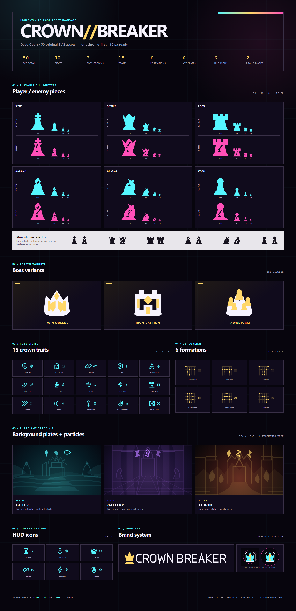
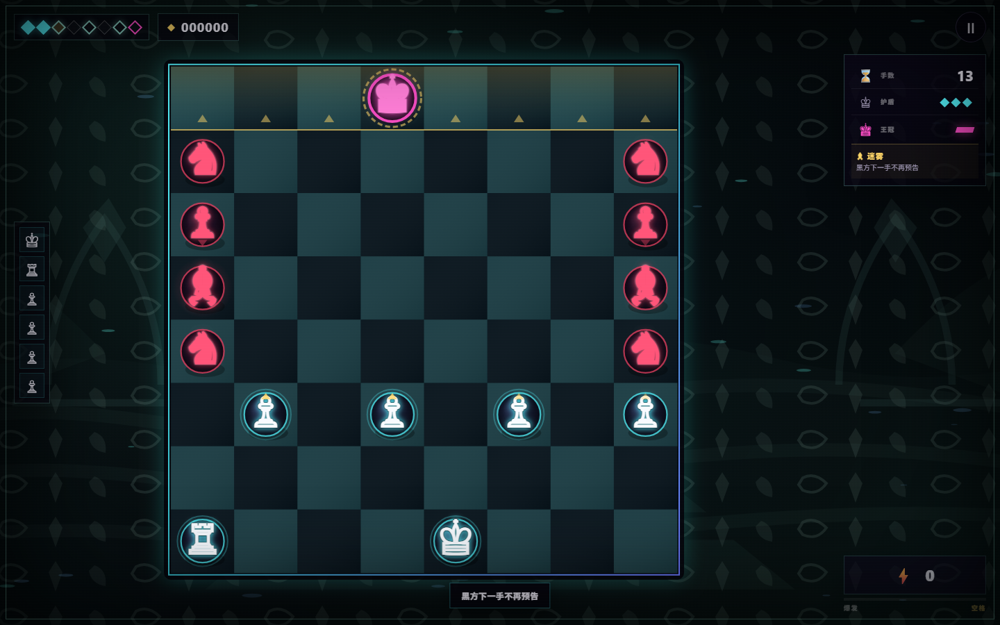
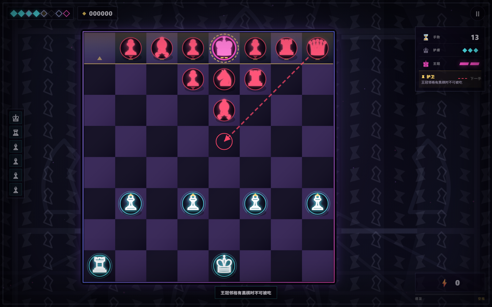
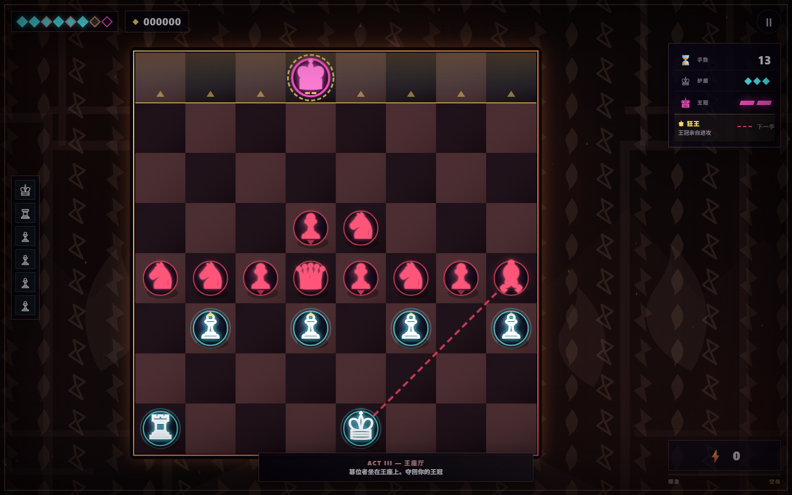

# CROWN//BREAKER

[English](#english) · [简体中文](#简体中文) · [日本語](#日本語)


## Art asset contact sheet

[Open the hosted, responsive 50-SVG contact sheet](https://hitsuki-ban.github.io/CrownBreaker/previews/assets.html).



<a id="english"></a>
## English

CROWN//BREAKER is a compact, browser-based board roguelite built around chess movement. Capture the crowned black king directly, carry promotions into later battles, collect seals, and choose a route through an eight-battle run. Check, checkmate, castling, and en passant are not part of the rules.

**[Play on GitHub Pages](https://hitsuki-ban.github.io/CrownBreaker/)**

The interface supports English, Simplified Chinese, and Japanese. On first launch it follows the device language; the language control in the game overrides that choice and stores the preference locally.

### Preview






### How to play

- Select a cyan piece, then select a highlighted destination.
- Cyan circles are moves, gold squares are captures, and red triangles mark threatened destinations.
- A red dashed line previews Black's next move.
- Fill the energy meter and activate the three-move burst with the on-screen control or the Space key.
- Press `H` for a suggested move and `Esc` to pause. Piece movement uses pointer or touch input.
- Promote pawns into knights, bishops, rooks, or queens. Promotions persist for the current run.

### Enemy contracts

Each contract combines one of six formation templates, up to four of twelve enemy modifiers, and one AI profile: Aggressive, Defensive, or Crown Guard. The four newest modifiers start a pawn as a queen (Promoted), give one gold-marked piece type move priority (Veteran), copy every non-king piece type in your roster (Mirror), or break your combo when Black captures (Executioner).

The route card's 8×5 preview and the real battle consume the same canonical `enemyLayout`; the preview is the deployment, not an estimate.

### Three-act run and story

The eight battles now form three distinct acts: the misted `outer` court in battles 1–3, the violet `gallery` in battles 4–6, and the ember-lit `throne` in battles 7–8. Each act changes the page treatment and Canvas palette, and supplies localized one- or two-line story beats at act entry, victory, and its fixed setpiece.

Battles 3, 5, and 7 are canonical, seed-independent setpieces rather than route rolls: The Mist Hunt, The Twin Gate, and The False Coronation. Battle 8 derives one of three bosses from the initial Run seed. Defeating Twin Queens, Iron Bastion, or Pawnstorm reaches that boss's own ending through the normal battle, tally, and final-result flow.

English, Simplified Chinese, and Japanese cover the full system and narrative text. The first launch follows the device language; the title and settings controls provide an explicit `System / English / 简体中文 / 日本語` override that is saved locally.

### Run locally

Serve the repository root over HTTP, then open `http://localhost:8080/`:

```bash
uv run python -m http.server 8080
```

Opening `index.html` directly is not the supported PWA path because service workers require HTTP or HTTPS.

### Verify, simulate, and build

The game has no third-party runtime dependencies. The balance simulator uses Playwright as an exact development dependency. Install dependencies and its Chromium browser once, then run the checks or a seeded simulation:

```bash
pnpm install
pnpm exec playwright install chromium
pnpm check
pnpm check:stages
pnpm check:traits
pnpm check:enemies
pnpm render:stages
pnpm sim -- --runs 100 --policy greedy --seed-base 12000
pnpm build:standalone dist/crown-breaker.html
```

`pnpm check:stages` verifies all three act themes, seed-independent setpiece contracts and coordinates, story-key coverage, and reduced-motion behavior. `pnpm render:stages` repeats that gate and writes the three 1440×900 reference screenshots in `previews/`.

`pnpm check:traits` runs targeted checks for all 15 crown traits plus 100 seeds per trait through the first three player hands.

`pnpm check:enemies` verifies all six formations, twelve modifiers, three AI profiles, and exact preview-to-battle layout parity.

`--runs`, `--policy` (`greedy` or `random`), and `--seed-base` are required. The simulator drives the real browser game through its QA interface and writes deterministic JSON plus Markdown reports to `reports/`. Repeating the same command produces identical report contents; the current date appears only in the default filenames.

The standalone build requires exactly one output path, creates its parent directory, and embeds the HTML, CSS, localization data, game code, and all six act background/particle SVGs into one file.

### Art asset package

Issue #5 delivers 50 original SVG sources: 12 player/enemy pieces, 3 boss crowns, all 15 current crown traits, 6 formations, 3 act backgrounds with 3 particle sheets, 6 HUD icons, and 2 brand marks. Review them in the [hosted contact sheet](https://hitsuki-ban.github.io/CrownBreaker/previews/assets.html) or rebuild the checked-in preview locally:

```bash
pnpm build:assets
pnpm check:assets
pnpm render:assets
```

`pnpm build:assets` and the maskable geometry gate in `pnpm check` require ImageMagick's `magick` command and fail explicitly when it is unavailable.

On 2026-07-21, `imagegen` produced three independent direction sheets — A Razor Heraldry, B Deco Court, and C Spectral Usurpation — and B Deco Court was selected. The concept sheets are comparison references and are not included in the release package. The final SVGs were drawn originally for this project from that direction and contain no external source artwork. Detailed generation hashes, geometry, color tokens, naming, and licensing boundaries are recorded in [`assets/STYLE_GUIDE.md`](assets/STYLE_GUIDE.md).

Version 3.7 consumes the six act background and particle SVGs in the live stage presentation and standalone build, paired with act-specific Canvas palettes. Piece silhouettes and rules remain on the established Canvas / Unicode path; there is no parallel or fallback renderer.

### PWA and offline use

The hosted version includes localized web app manifests and a service worker. After one successful online load, the core game files are cached for offline use. Installation support varies by browser and platform. Progress and the selected language are stored in browser local storage; clearing site data removes them.

### Project structure

- `index.html`, `styles.css` — page structure and responsive presentation
- `i18n.js`, `game.js` — localization catalog, game rules, state, audio, and rendering
- `manifest*.webmanifest`, `sw.js`, `icon*` — installable/offline web app assets
- `assets/` — 50 original SVG sources, deterministic catalog, and art direction guide
- `previews/` — game screenshots plus the hosted art contact sheet
- `tools/` — static/asset/stage checks, deterministic asset export, contact-sheet and stage renderers, simulator, and standalone builder
- `DESIGN_NOTES.md`, `COPY_GUIDE.md`, `QA_REPORT.md`, `CHANGELOG.md` — design and release documentation

### License

Released under the [MIT License](LICENSE.txt).

<a id="简体中文"></a>
## 简体中文

CROWN//BREAKER 是一款基于国际象棋走法的浏览器短局棋盘肉鸽。直接吃掉戴冠黑王，在八场对局中保留升变棋子、取得棋印并选择路线。规则不采用将军、将死、王车易位或吃过路兵。

**[在 GitHub Pages 直接体验](https://hitsuki-ban.github.io/CrownBreaker/)**

界面提供 English、简体中文和日本語。首次启动会自动跟随设备语言；游戏内语言选项可覆盖自动判断，并将选择保存在本机。

### 玩法

- 点选青色棋子，再点亮起的目标格。
- 青色圆点表示移动，金色方框表示吃子，红色三角表示危险落点。
- 红色虚线会预告黑方下一手。
- 能量充满后可点按界面按钮或空格键发动三连手。
- `H` 显示推荐行动，`Esc` 暂停；棋子移动使用鼠标或触控。
- 兵可升变为马、象、车或后，升变结果在本次 Run 中保留。

### 敌方合约

每份合约组合 6 种阵型模板之一、最多 4 个（共 12 个）敌阵词缀，以及强攻、坚守、护冠 3 种 AI 策略之一。4 个新词缀分别让黑兵开局晋升为后（晋升军）、让一种金标敌棋优先行动（老兵）、复制玩家棋组中的每种非王棋（镜像），或让黑方吃子时斩断玩家连击（行刑者）。

路线卡的 8×5 预览与实盘读取同一份 canonical `enemyLayout`；预览就是实际布阵，不是估算图。

### 三幕流程与剧情

八场战斗现在组成三个视觉与叙事均独立的幕：第 1–3 战为青雾笼罩的 `outer` 外苑，第 4–6 战为紫色 `gallery` 回廊，第 7–8 战为金赤火光中的 `throne` 王座厅。每一幕都会切换页面装饰与 Canvas 调色，并在幕启、胜利和固定剧情战显示本地化的一至两行叙事。

第 3、5、7 战分别是与 Run 种子无关、合同完全固定的“雾中围猎”“双生门”“伪加冕”，不参与路线抽取。第 8 战从 Run 初始种子派生双后、铁壁或兵暴三种 Boss；通过正常战斗、结算和最终结果流程击败它们时，会进入各自不同的结局。

完整系统与剧情文案均提供 English、简体中文和日本語。首次启动跟随设备语言；标题页与设置页提供 `系统 / English / 简体中文 / 日本語` 的显式自定义选项，并把选择保存在本机。

### 本地运行

在仓库根目录启动 HTTP 服务，再访问 `http://localhost:8080/`：

```bash
uv run python -m http.server 8080
```

直接打开 `index.html` 不属于受支持的 PWA 运行方式，因为 Service Worker 需要 HTTP 或 HTTPS。

### 验证、模拟与单文件构建

游戏本身没有第三方运行时依赖；平衡模拟器将 Playwright 固定为开发依赖。首次使用先安装依赖及其 Chromium 浏览器，再执行检查或固定种子模拟：

```bash
pnpm install
pnpm exec playwright install chromium
pnpm check
pnpm check:stages
pnpm check:traits
pnpm check:enemies
pnpm render:stages
pnpm sim -- --runs 100 --policy greedy --seed-base 12000
pnpm build:standalone dist/crown-breaker.html
```

`pnpm check:stages` 会验证三幕主题、固定剧情战的合同与坐标不受种子影响、剧情键完整性和减少动态模式；`pnpm render:stages` 会重复这道门禁，并把三张 1440×900 参考截图写入 `previews/`。

`pnpm check:traits` 会逐项检查全部 15 种王冠特性，并为每种特性运行 100 个种子的前三次玩家行动。

`pnpm check:enemies` 会复验 6 种阵型、12 个词缀、3 种 AI 策略，以及路线预览与实盘布局完全一致。

`--runs`、`--policy`（`greedy` 或 `random`）和 `--seed-base` 均为必填。模拟器通过 QA 接口驱动真实浏览器游戏，并在 `reports/` 输出确定性的 JSON 与 Markdown 报告；同一命令重复执行时报告内容完全一致，当前日期只会进入默认文件名。

单文件构建命令必须明确提供唯一输出路径；工具会创建父目录，并把页面、样式、本地化数据、游戏代码及六张幕背景/粒子 SVG 全部内联到一个 HTML 文件中。

### 美术素材包

Issue #5 交付 50 项原创 SVG 源素材：12 枚玩家/敌方棋子、3 枚 Boss 王冠、当前完整的 15 个王冠特性、6 种阵形、3 幕背景与对应 3 张粒子表、6 枚 HUD 图标，以及 2 项品牌标记。可在[线上素材陈列页](https://hitsuki-ban.github.io/CrownBreaker/previews/assets.html)查看，或在本地重新构建已检入的预览图：

```bash
pnpm build:assets
pnpm check:assets
pnpm render:assets
```

`pnpm build:assets` 与 `pnpm check` 中的 maskable 像素几何门禁需要系统提供 ImageMagick 的 `magick` 命令；工具缺失时会明确失败。

2026-07-21 使用 `imagegen` 分别生成了 A Razor Heraldry、B Deco Court、C Spectral Usurpation 三套独立方向稿，经比较后选定 B Deco Court。方向稿只作比较参考，未纳入发布包；最终 SVG 由本项目基于所选方向原创绘制，不含外部来源素材。生成稿哈希、几何规格、颜色 token、命名与许可边界详见 [`assets/STYLE_GUIDE.md`](assets/STYLE_GUIDE.md)。

v3.7 已在实机舞台表现和单文件构建中消费六张幕背景/粒子 SVG，并与每幕独立的 Canvas 调色联动。棋子轮廓和规则仍沿用既有 Canvas / Unicode 路径，不存在并行或回退渲染器。

### PWA 与离线

托管版包含三语 Web App Manifest 与 Service Worker。首次联网成功加载后，核心游戏文件会进入离线缓存。是否支持安装取决于浏览器与平台。进度和语言选择保存在浏览器本地存储中；清除站点数据会同时移除它们。

### 项目结构

- `index.html`、`styles.css`：页面结构与响应式样式
- `i18n.js`、`game.js`：三语文案、游戏规则、状态、音频与渲染
- `manifest*.webmanifest`、`sw.js`、`icon*`：PWA 安装与离线资源
- `assets/`：50 项原创 SVG 源素材、确定性目录清单与艺术方向说明
- `previews/`：游戏截图与可托管的素材陈列页
- `tools/`：静态/素材/舞台检查、确定性素材导出、陈列页与舞台渲染、模拟器及单文件构建工具
- `DESIGN_NOTES.md`、`COPY_GUIDE.md`、`QA_REPORT.md`、`CHANGELOG.md`：设计与发布文档

### 许可

本项目采用 [MIT License](LICENSE.txt)。

<a id="日本語"></a>
## 日本語

CROWN//BREAKER は、チェスの駒の動きを土台にしたブラウザ向け短編ボードローグライトです。冠を持つ黒のキングを直接取り、8 戦のあいだ昇格した駒を引き継ぎ、シールを獲得し、次のルートを選びます。チェック、チェックメイト、キャスリング、アンパッサンは使用しません。

**[GitHub Pages でプレイ](https://hitsuki-ban.github.io/CrownBreaker/)**

画面表示は English、簡体中文、日本語に対応しています。初回起動時は端末の言語を自動判定し、ゲーム内の言語設定で上書きできます。選択した言語は端末内に保存されます。

### 遊び方

- シアンの駒を選び、ハイライトされた移動先を選びます。
- シアンの丸は移動、金色の四角は捕獲、赤い三角は攻撃されるマスを示します。
- 赤い破線は黒側の次の手を予告します。
- エネルギーが満タンになったら、画面の操作または Space キーで 3 連続行動を発動します。
- `H` で推奨手を表示し、`Esc` で一時停止します。駒の移動にはポインターまたはタッチ操作を使います。
- ポーンはナイト、ビショップ、ルーク、クイーンに昇格でき、その結果は現在の Run 中に引き継がれます。

### 敵側コントラクト

各コントラクトは、6 種の陣形テンプレートから 1 つ、全 12 種から最大 4 つの敵陣モディファイア、そして猛攻・堅守・王冠護衛の 3 AI プロファイルから 1 つを組み合わせます。新しい 4 種は、黒ポーンをクイーンとして開始（昇格済み）、金印の駒種を優先行動（古参）、編成内のキング以外の各駒種を黒側に複製（鏡像）、黒側の駒取りでコンボを切断（処刑人）します。

ルートカードの 8×5 プレビューと実戦は、同一の canonical `enemyLayout` を使用します。プレビューは概算ではなく、実際の配置そのものです。

### 3 幕構成と物語

8 戦は、青い霧の `outer` 外苑（1–3 戦）、紫の `gallery` 回廊（4–6 戦）、金赤の火の粉が舞う `throne` 玉座の間（7–8 戦）という、視覚と物語の異なる 3 幕で構成されます。幕ごとにページ演出と Canvas パレットが切り替わり、幕の開始、勝利、固定イベント戦ではローカライズされた 1～2 行の物語が表示されます。

3、5、7 戦は Run シードに左右されない固定コントラクト「霧中の狩り」「双生門」「偽りの戴冠」で、ルート抽選には入りません。8 戦目のボスは Run の初期シードから双クイーン、鉄壁、ポーンストームのいずれかに決まり、通常の戦闘、集計、最終リザルトを経て倒すと、それぞれ固有のエンディングへ到達します。

システムと物語の全文は English、簡体中文、日本語に対応しています。初回は端末言語に従い、タイトルと設定では `システム / English / 简体中文 / 日本語` を明示的に選んで端末内に保存できます。

### ローカル実行

リポジトリのルートで HTTP サーバーを起動し、`http://localhost:8080/` を開きます。

```bash
uv run python -m http.server 8080
```

Service Worker には HTTP または HTTPS が必要なため、`index.html` の直接起動は PWA の対応経路ではありません。

### 検証・シミュレーション・単一 HTML ビルド

ゲーム本体にサードパーティーの実行時依存はありません。バランスシミュレーターは Playwright を固定バージョンの開発依存として使用します。初回に依存関係と Chromium をインストールしてから、検証またはシード指定のシミュレーションを実行します。

```bash
pnpm install
pnpm exec playwright install chromium
pnpm check
pnpm check:stages
pnpm check:traits
pnpm check:enemies
pnpm render:stages
pnpm sim -- --runs 100 --policy greedy --seed-base 12000
pnpm build:standalone dist/crown-breaker.html
```

`pnpm check:stages` は 3 幕のテーマ、固定イベント戦のコントラクトと座標がシード非依存であること、物語キー、低モーション設定を検証します。`pnpm render:stages` は同じゲートを再実行し、1440×900 の参照画像 3 枚を `previews/` に書き出します。

`pnpm check:traits` は全 15 種のクラウン特性を個別検証し、各特性 100 シードの最初のプレイヤー 3 手を実行します。

`pnpm check:enemies` は 6 種の陣形、12 種のモディファイア、3 種の AI プロファイル、およびプレビューと実戦配置の完全一致を検証します。

`--runs`、`--policy`（`greedy` または `random`）、`--seed-base` はすべて必須です。シミュレーターは QA インターフェースを通して実ブラウザー上のゲームを操作し、`reports/` に決定的な JSON と Markdown のレポートを出力します。同じコマンドのレポート内容は一致し、現在の日付は既定のファイル名だけに入ります。

単一 HTML ビルドには出力先を 1 つだけ明示する必要があります。親ディレクトリを作成し、HTML、CSS、翻訳データ、ゲームコード、6 枚の幕背景/パーティクル SVG を 1 ファイルに埋め込みます。

### アート素材パッケージ

Issue #5 では、プレイヤー/敵側の駒 12 点、ボスクラウン 3 点、現行のクラウン特性全 15 点、陣形 6 点、3 幕の背景と粒子シート 3 点、HUD アイコン 6 点、ブランドマーク 2 点からなる、合計 50 点のオリジナル SVG ソースを提供します。[ホスト版コンタクトシート](https://hitsuki-ban.github.io/CrownBreaker/previews/assets.html)で確認するか、チェックイン済みプレビューをローカルで再生成できます。

```bash
pnpm build:assets
pnpm check:assets
pnpm render:assets
```

`pnpm build:assets` と `pnpm check` の maskable ピクセル形状検査には、ImageMagick の `magick` コマンドが必要です。利用できない場合は明示的に失敗します。

2026-07-21 に `imagegen` で A Razor Heraldry、B Deco Court、C Spectral Usurpation の独立した 3 方向案を生成し、比較後に B Deco Court を採用しました。方向案は比較用の参照で、公開パッケージには含まれません。最終 SVG は選定方向を基に本プロジェクト向けに独自制作し、外部由来の素材を含みません。生成案のハッシュ、ジオメトリ、カラートークン、命名、ライセンス境界は [`assets/STYLE_GUIDE.md`](assets/STYLE_GUIDE.md) に記録しています。

v3.7 では 6 枚の幕背景/パーティクル SVG を実際のステージ演出と単一 HTML に組み込み、幕別の Canvas パレットと連動させています。駒のシルエットとルールは既存の Canvas / Unicode 経路を維持し、並行レンダラーやフォールバックはありません。

### PWA とオフライン

ホスト版には各言語の Web App Manifest と Service Worker が含まれます。オンラインで一度正常に読み込むと、ゲームの主要ファイルがオフライン用にキャッシュされます。インストール対応はブラウザと OS によって異なります。進行状況と言語設定はブラウザのローカルストレージに保存され、サイトデータを消去すると削除されます。

### プロジェクト構成

- `index.html`、`styles.css` — ページ構造とレスポンシブ表示
- `i18n.js`、`game.js` — 翻訳カタログ、ゲームルール、状態、音声、描画
- `manifest*.webmanifest`、`sw.js`、`icon*` — インストールとオフライン対応
- `assets/` — オリジナル SVG 50 点、決定的カタログ、アート方針ガイド
- `previews/` — ゲーム画像とホスト可能なアート・コンタクトシート
- `tools/` — 静的/素材/ステージ検査、決定的素材出力、コンタクトシートとステージ描画、シミュレーター、単一 HTML ビルダー
- `DESIGN_NOTES.md`、`COPY_GUIDE.md`、`QA_REPORT.md`、`CHANGELOG.md` — 設計・リリース文書

### ライセンス

[MIT License](LICENSE.txt) で公開しています。
