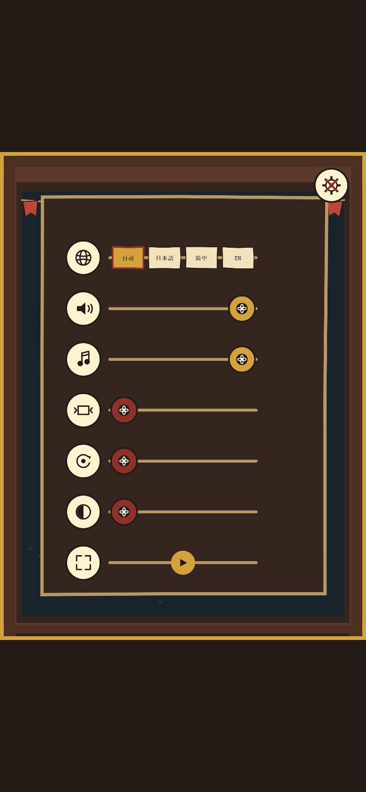

# TUMBLEDRUM / 滚鼓祭

一个可离线运行的 HTML5 Canvas 演出型打砖块游戏。玩法围绕中心击球蓄力、材质差异、结构坍塌、祭典爆发、有限护符构筑、12 个手工关卡与最终 Boss 展开，并提供无尽模式、程序化音频、本地存档和无障碍设置。

## 直接游玩

- GitHub Pages：<https://hitsuki-ban.github.io/TUMBLEDRUM/>
- 离线版：下载并双击 `TUMBLEDRUM_PLAY.html`

离线版已经内联全部 CSS、JavaScript 与图形，不需要安装、服务器或网络。

## 语言

界面完整提供日语、简体中文和英语。初次打开时跟随浏览器/系统语言：日语环境使用日语，中文环境使用简体中文，其他环境使用英语。设置页可随时选择“自动 / 日本語 / 简中 / EN”，选择会保存到本机。

## 操作

- 鼠标 / 触摸：移动鼓车；点击或轻触发球。祭典鼓充满时，点击鼓面可立即触发爆发。
- 键盘：方向键左右或 A / D 移动；空格确认或发球；Esc / P 暂停；F 全屏。
- 菜单：方向键选择，Enter / 空格确认，Esc 返回。
- 手柄：左摇杆或十字键移动与选择；南键确认；Start 暂停。

球会自动发射，祭典爆发充满后也会延迟自动触发，因此只理解“左右移动”仍可完成基础玩法。

## 本地运行、构建与测试

本项目的开发工具使用 Python 3.12 和 `uv` 固定依赖：

```powershell
uv sync --dev
uv run python -m http.server 8000
```

浏览器访问 <http://127.0.0.1:8000/>。重建单文件离线版：

```powershell
uv run python tools/build_single.py
```

服务器运行时，可在另一终端执行：

```powershell
uv run python tests/smoke_test.py http://127.0.0.1:8000/
uv run python tests/integration_test.py http://127.0.0.1:8000/
uv run python tests/regression_test.py http://127.0.0.1:8000/
uv run python tests/full_run_test.py http://127.0.0.1:8000/
```

## 文件

- `index.html`, `styles.css`, `src/*.js`：GitHub Pages 与本地服务器使用的可读源码。
- `src/i18n.js`：严格校验的日/中/英文本目录、系统语言解析和切换持久化。
- `TUMBLEDRUM_PLAY.html`：可直接双击运行的单文件离线版。
- `RESEARCH_AND_DESIGN_CN.md`, `RESEARCH_AND_DESIGN.md`：设计依据、产品语言、数值与扩展契约。
- `TEST_REPORT.md`, `BUILD_INFO.json`：验收记录和可复核构建信息。
- `tools/build_single.py`：生成并验证单文件版。
- `tests/*.py`：浏览器冒烟、集成、回归与完整流程测试。
- `.nojekyll`：确保仓库根目录可直接作为 GitHub Pages 内容发布。

## 浏览器

面向当前 Chromium、Firefox 与 Safari 级浏览器。浏览器自动播放策略要求首次用户手势后才启动声音。



---

TUMBLEDRUM is an offline-capable HTML5 Canvas arcade game built around readable spectacle, structural cascades, center-hit mastery, bounded run upgrades, an authored campaign, a final boss, Endless mode, procedural audio, local persistence, and Japanese/Simplified Chinese/English localization.
