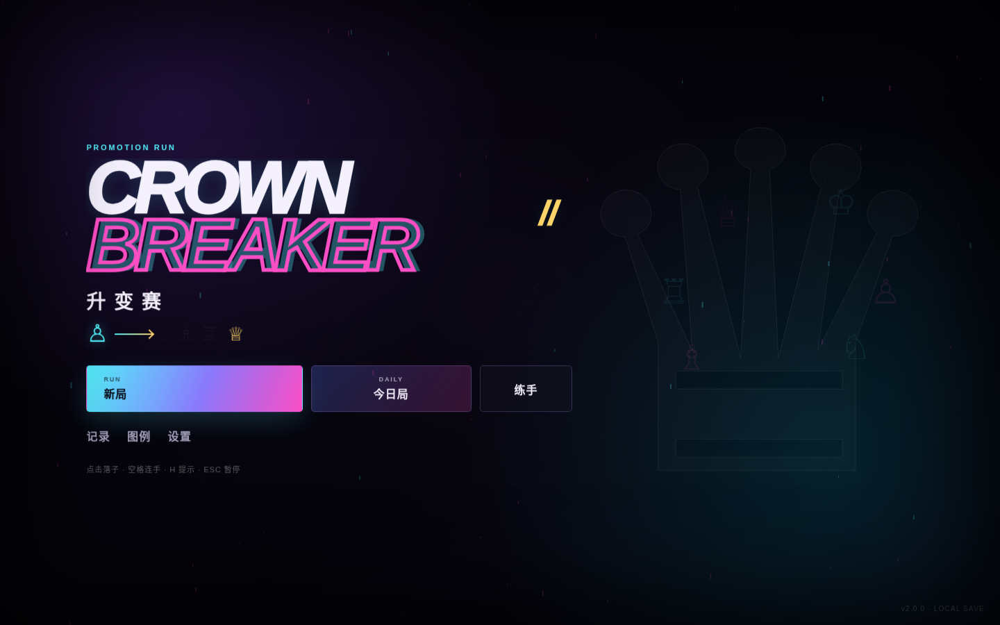
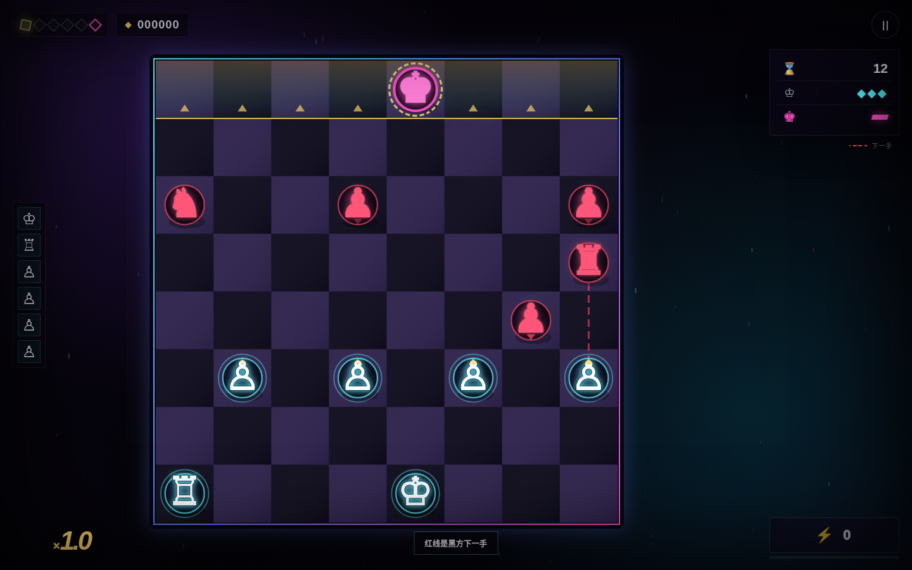
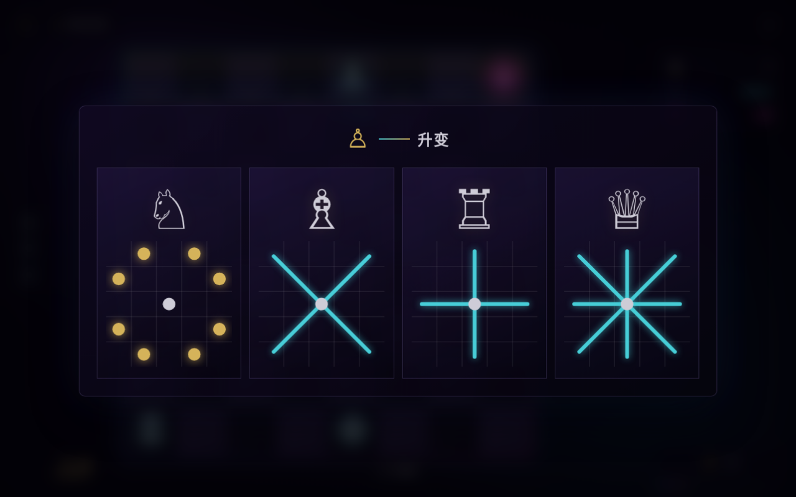
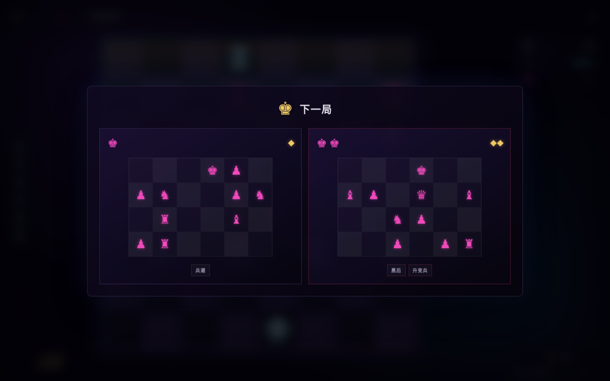
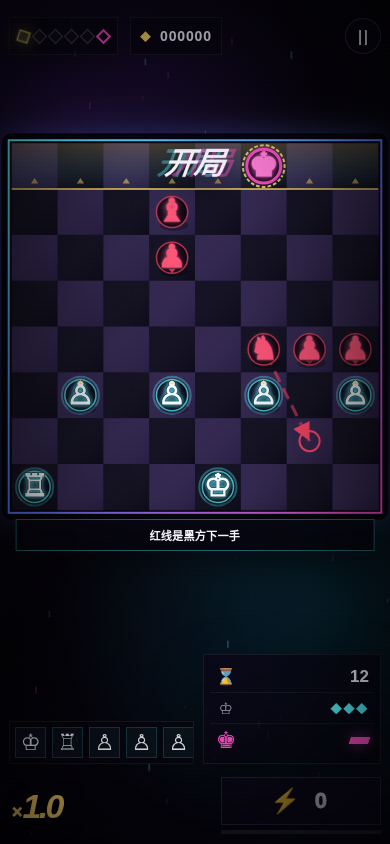

# CROWN//BREAKER

[English](#english) · [简体中文](#简体中文) · [日本語](#日本語)



<a id="english"></a>
## English

CROWN//BREAKER is a compact, browser-based board roguelite built around chess movement. Capture the crowned black king directly, carry promotions into later battles, collect seals, and choose a route through a six-battle run. Check, checkmate, castling, and en passant are not part of the rules.

**[Play on GitHub Pages](https://hitsuki-ban.github.io/CrownBreaker/)**

The interface supports English, Simplified Chinese, and Japanese. On first launch it follows the device language; the language control in the game overrides that choice and stores the preference locally.

### Preview






### How to play

- Select a cyan piece, then select a highlighted destination.
- Cyan circles are moves, gold squares are captures, and red triangles mark threatened destinations.
- A red dashed line previews Black's next move.
- Fill the energy meter and activate the three-move burst with the on-screen control or the Space key.
- Press `H` for a suggested move and `Esc` to pause. Piece movement uses pointer or touch input.
- Promote pawns into knights, bishops, rooks, or queens. Promotions persist for the current run.

### Run locally

Serve the repository root over HTTP, then open `http://localhost:8080/`:

```bash
uv run python -m http.server 8080
```

Opening `index.html` directly is not the supported PWA path because service workers require HTTP or HTTPS.

### Verify, simulate, and build

The game has no third-party runtime dependencies. The balance simulator uses Playwright as an exact development dependency. Install dependencies and its Chromium browser once, then run the checks or a seeded simulation:

```bash
pnpm install
pnpm exec playwright install chromium
pnpm check
pnpm sim -- --runs 100 --policy greedy --seed-base 12000
pnpm build:standalone dist/crown-breaker.html
```

`--runs`, `--policy` (`greedy` or `random`), and `--seed-base` are required. The simulator drives the real browser game through its QA interface and writes deterministic JSON plus Markdown reports to `reports/`. Repeating the same command produces identical report contents; the current date appears only in the default filenames.

The standalone build requires exactly one output path, creates its parent directory, and embeds the HTML, CSS, localization data, and game code into one file.

### PWA and offline use

The hosted version includes localized web app manifests and a service worker. After one successful online load, the core game files are cached for offline use. Installation support varies by browser and platform. Progress and the selected language are stored in browser local storage; clearing site data removes them.

### Project structure

- `index.html`, `styles.css` — page structure and responsive presentation
- `i18n.js`, `game.js` — localization catalog, game rules, state, audio, and rendering
- `manifest*.webmanifest`, `sw.js`, `icon*` — installable/offline web app assets
- `previews/` — title, gameplay, promotion, route, and mobile screenshots
- `tools/` — static release checks and standalone builder
- `DESIGN_NOTES.md`, `COPY_GUIDE.md`, `QA_REPORT.md`, `CHANGELOG.md` — design and release documentation

### License

Released under the [MIT License](LICENSE.txt).

<a id="简体中文"></a>
## 简体中文

CROWN//BREAKER 是一款基于国际象棋走法的浏览器短局棋盘肉鸽。直接吃掉戴冠黑王，在六场对局中保留升变棋子、取得棋印并选择路线。规则不采用将军、将死、王车易位或吃过路兵。

**[在 GitHub Pages 直接体验](https://hitsuki-ban.github.io/CrownBreaker/)**

界面提供 English、简体中文和日本語。首次启动会自动跟随设备语言；游戏内语言选项可覆盖自动判断，并将选择保存在本机。

### 玩法

- 点选青色棋子，再点亮起的目标格。
- 青色圆点表示移动，金色方框表示吃子，红色三角表示危险落点。
- 红色虚线会预告黑方下一手。
- 能量充满后可点按界面按钮或空格键发动三连手。
- `H` 显示推荐行动，`Esc` 暂停；棋子移动使用鼠标或触控。
- 兵可升变为马、象、车或后，升变结果在本次 Run 中保留。

### 本地运行

在仓库根目录启动 HTTP 服务，再访问 `http://localhost:8080/`：

```bash
uv run python -m http.server 8080
```

直接打开 `index.html` 不属于受支持的 PWA 运行方式，因为 Service Worker 需要 HTTP 或 HTTPS。

### 验证、模拟与单文件构建

游戏本身没有第三方运行时依赖；平衡模拟器将 Playwright 固定为开发依赖。首次使用先安装依赖及其 Chromium 浏览器，再执行检查或固定种子模拟：

```bash
pnpm install
pnpm exec playwright install chromium
pnpm check
pnpm sim -- --runs 100 --policy greedy --seed-base 12000
pnpm build:standalone dist/crown-breaker.html
```

`--runs`、`--policy`（`greedy` 或 `random`）和 `--seed-base` 均为必填。模拟器通过 QA 接口驱动真实浏览器游戏，并在 `reports/` 输出确定性的 JSON 与 Markdown 报告；同一命令重复执行时报告内容完全一致，当前日期只会进入默认文件名。

单文件构建命令必须明确提供唯一输出路径；工具会创建父目录，并把页面、样式、本地化数据和游戏代码内联到一个 HTML 文件中。

### PWA 与离线

托管版包含三语 Web App Manifest 与 Service Worker。首次联网成功加载后，核心游戏文件会进入离线缓存。是否支持安装取决于浏览器与平台。进度和语言选择保存在浏览器本地存储中；清除站点数据会同时移除它们。

### 项目结构

- `index.html`、`styles.css`：页面结构与响应式样式
- `i18n.js`、`game.js`：三语文案、游戏规则、状态、音频与渲染
- `manifest*.webmanifest`、`sw.js`、`icon*`：PWA 安装与离线资源
- `previews/`：标题、对局、升变、路线与手机截图
- `tools/`：静态发布检查与单文件构建工具
- `DESIGN_NOTES.md`、`COPY_GUIDE.md`、`QA_REPORT.md`、`CHANGELOG.md`：设计与发布文档

### 许可

本项目采用 [MIT License](LICENSE.txt)。

<a id="日本語"></a>
## 日本語

CROWN//BREAKER は、チェスの駒の動きを土台にしたブラウザ向け短編ボードローグライトです。冠を持つ黒のキングを直接取り、6 戦のあいだ昇格した駒を引き継ぎ、シールを獲得し、次のルートを選びます。チェック、チェックメイト、キャスリング、アンパッサンは使用しません。

**[GitHub Pages でプレイ](https://hitsuki-ban.github.io/CrownBreaker/)**

画面表示は English、簡体中文、日本語に対応しています。初回起動時は端末の言語を自動判定し、ゲーム内の言語設定で上書きできます。選択した言語は端末内に保存されます。

### 遊び方

- シアンの駒を選び、ハイライトされた移動先を選びます。
- シアンの丸は移動、金色の四角は捕獲、赤い三角は攻撃されるマスを示します。
- 赤い破線は黒側の次の手を予告します。
- エネルギーが満タンになったら、画面の操作または Space キーで 3 連続行動を発動します。
- `H` で推奨手を表示し、`Esc` で一時停止します。駒の移動にはポインターまたはタッチ操作を使います。
- ポーンはナイト、ビショップ、ルーク、クイーンに昇格でき、その結果は現在の Run 中に引き継がれます。

### ローカル実行

リポジトリのルートで HTTP サーバーを起動し、`http://localhost:8080/` を開きます。

```bash
uv run python -m http.server 8080
```

Service Worker には HTTP または HTTPS が必要なため、`index.html` の直接起動は PWA の対応経路ではありません。

### 検証・シミュレーション・単一 HTML ビルド

ゲーム本体にサードパーティーの実行時依存はありません。バランスシミュレーターは Playwright を固定バージョンの開発依存として使用します。初回に依存関係と Chromium をインストールしてから、検証またはシード指定のシミュレーションを実行します。

```bash
pnpm install
pnpm exec playwright install chromium
pnpm check
pnpm sim -- --runs 100 --policy greedy --seed-base 12000
pnpm build:standalone dist/crown-breaker.html
```

`--runs`、`--policy`（`greedy` または `random`）、`--seed-base` はすべて必須です。シミュレーターは QA インターフェースを通して実ブラウザー上のゲームを操作し、`reports/` に決定的な JSON と Markdown のレポートを出力します。同じコマンドのレポート内容は一致し、現在の日付は既定のファイル名だけに入ります。

単一 HTML ビルドには出力先を 1 つだけ明示する必要があります。親ディレクトリを作成し、HTML、CSS、翻訳データ、ゲームコードを 1 ファイルに埋め込みます。

### PWA とオフライン

ホスト版には各言語の Web App Manifest と Service Worker が含まれます。オンラインで一度正常に読み込むと、ゲームの主要ファイルがオフライン用にキャッシュされます。インストール対応はブラウザと OS によって異なります。進行状況と言語設定はブラウザのローカルストレージに保存され、サイトデータを消去すると削除されます。

### プロジェクト構成

- `index.html`、`styles.css` — ページ構造とレスポンシブ表示
- `i18n.js`、`game.js` — 翻訳カタログ、ゲームルール、状態、音声、描画
- `manifest*.webmanifest`、`sw.js`、`icon*` — インストールとオフライン対応
- `previews/` — タイトル、ゲーム、昇格、ルート、モバイルのスクリーンショット
- `tools/` — 静的リリース検査と単一 HTML ビルダー
- `DESIGN_NOTES.md`、`COPY_GUIDE.md`、`QA_REPORT.md`、`CHANGELOG.md` — 設計・リリース文書

### ライセンス

[MIT License](LICENSE.txt) で公開しています。
